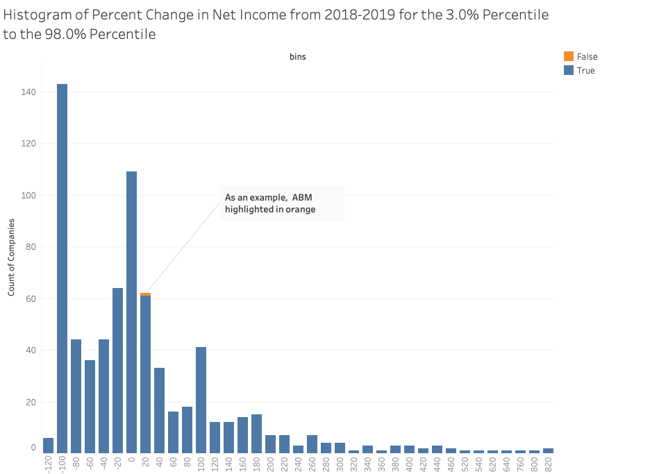
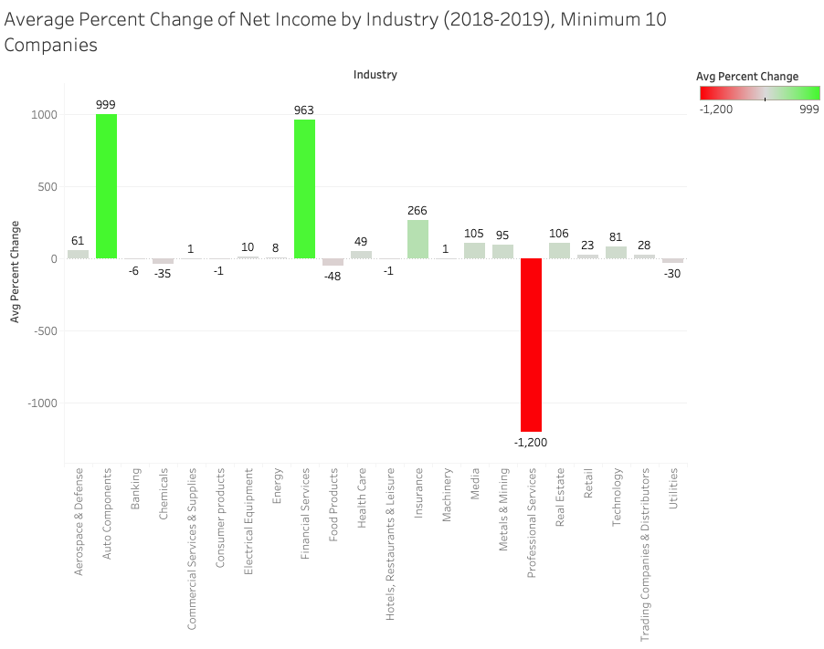
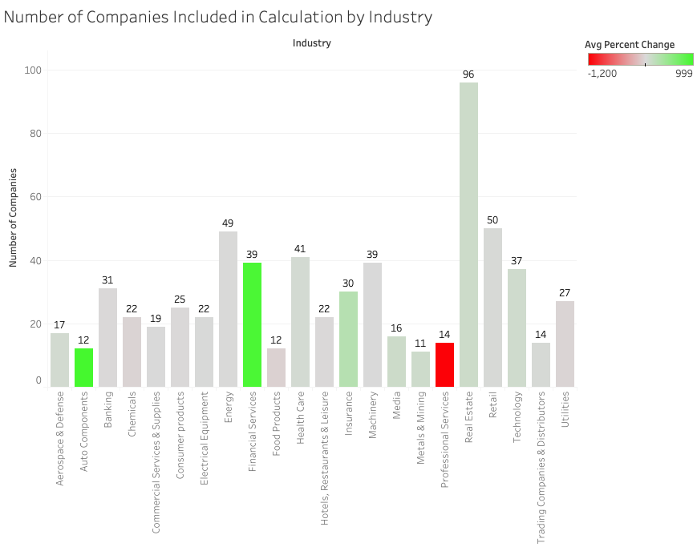

# Introduction
### Utilize the [FinnHub](https://finnhub.io/) API to gather data parsed out of 10K financial statements, then reformat that data into usable analysis. 
With a list of ticker symbols (companies) as input, the script queries FinnHub for each company and receives a list of 10K documents by that company. For each document, the script records basic information and one quantitative metric. The user chooses which quantitative metric to store and then analyze (by default net income). The script then uses the company profile endpoint of the FinnHub API to add information, such as 'Industry' and 'MarketCap'.

Before the analysis stage each row represents a 10K document. So each row can be thought of as a unique company-year pair. During the analysis stage, the script creates one row per company that shows the change of the company over the years (in terms of the quantitative metric). This allows for easy horizontal analysis on the company for that quantitative metric.

# Installation
Download the package from GitHub, and get a [FinnHub](https://finnhub.io/) API key. Create a file named "api.txt" and store it in the same folder as the rest of the package. In this text file should be the API key and no other text or formatting.

# Usage

Run the script through the main.py file. Edit the default settings if it suits your needs.
```
python main.py
```
Type 'Y' to start the script, 'L' to see the current settings, and 'N' to cancel the script. (Not case-sensitive).
# Example Data Insights
### A histogram of the percent change of Net Income for NYSE companies over 2018-2019. Not every NYSE company was available through FinnHub. The high and low outliers have been excluded to fit the graph onto one page.


### A bar graph comparing the average percent change of Net Income for NYSE companies across industries for 2018-2019. Not every NYSE company was available through FinnHub. The number of companies behind each data point varies, the minimum being 10.


### A bar graph indicating the number of companies behind each data point of the previous graph
